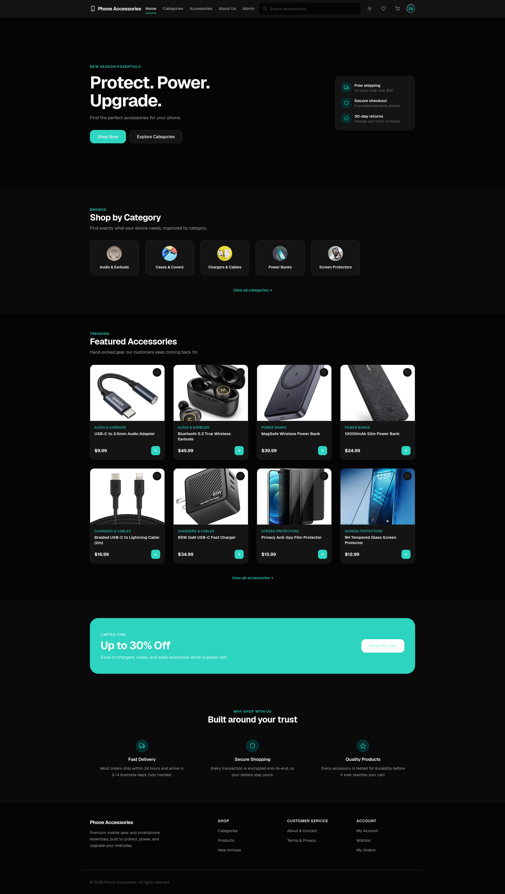
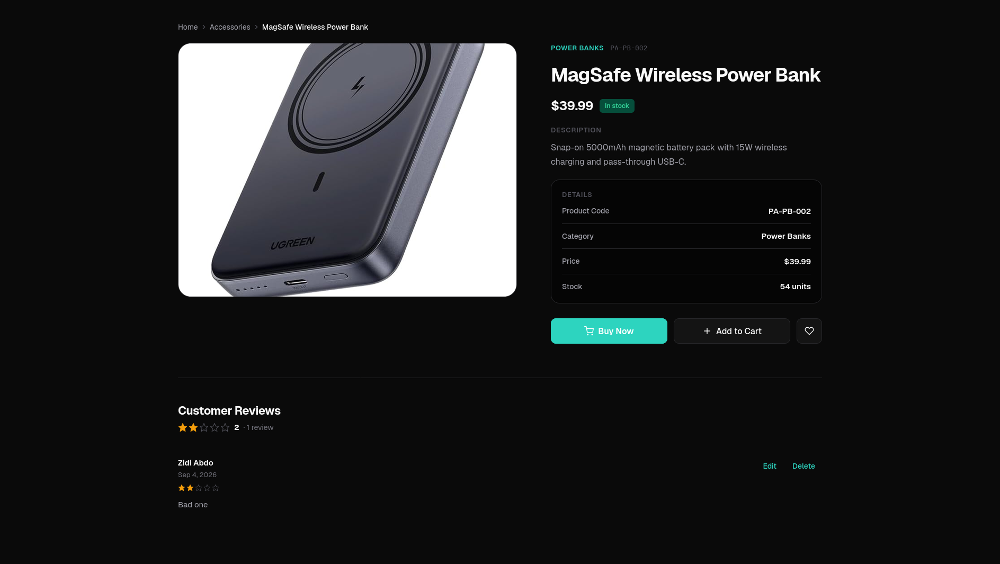
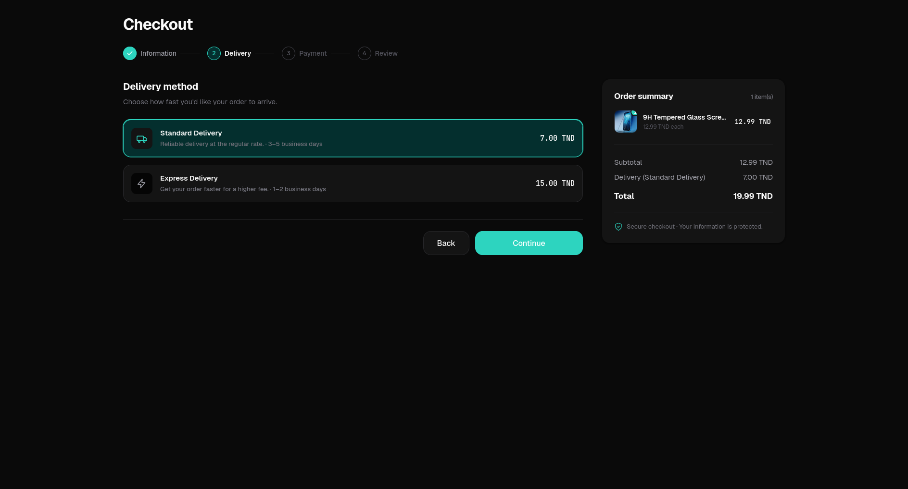
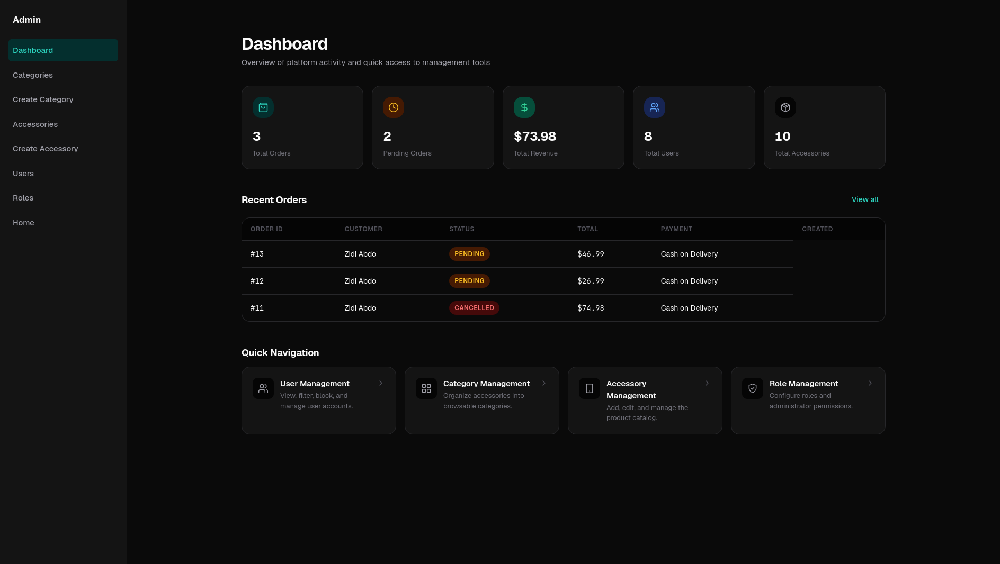

# Phone Accessories — Frontend

> Premium mobile gear & smartphone essentials — a modern e-commerce single-page application built with Angular.

An end-to-end e-commerce storefront for phone accessories (cases, chargers, cables, screen protectors, power banks and audio gear). It ships with a full shopping experience — catalog browsing, search & filtering, product reviews, cart, wishlist, multi-step checkout, order history — plus a complete authenticated admin suite for managing catalog content, users and roles.

> **Note:** This repository contains the frontend project only.
> The backend is available at [phone-accessories-backend](https://github.com/zidi-abderrahmen/phone-accessories-backend).


<p align="center">
  <a href="https://phone-accessories-frontend.zd-abderrahmen.workers.dev">🔗 Live Demo</a>
</p>

---

## Table of Contents

- [Overview](#overview)
- [Features](#features)
- [Screenshots](#screenshots)
- [Tech Stack](#tech-stack)
- [Architecture](#architecture)
- [Project Structure](#project-structure)
- [Routing & Navigation](#routing--navigation)
- [State Management](#state-management)
- [Authentication & Authorization](#authentication--authorization)
- [API Communication & Backend Integration](#api-communication--backend-integration)
- [Installation](#installation)
- [Environment Setup](#environment-setup)
- [Running Locally](#running-locally)
- [Build & Production Deployment](#build--production-deployment)
- [Testing](#testing)
- [Performance & Security Considerations](#performance--security-considerations)
- [Roadmap](#roadmap)
- [Contributing](#contributing)
- [License](#license)
- [Author](#author)

---

## Overview

The **Phone Accessories** frontend is the client half of a full-stack e-commerce platform. It is a completely server-rendered-free, client-side Angular application whose purpose is to let customers discover and purchase premium smartphone accessories while giving administrators the tooling to operate the catalog and user base.

**What it delivers**

- A **fast, reactive shopping experience** — lazy-loaded standalone routes, a searchable catalog with faceted filtering (category, keyword, price range, stock), and instant wishlist/cart feedback.
- A **complete customer account lifecycle** — registration, email verification, login, forgot/reset password, profile management, order history and order cancellation.
- A **checkout flow built like a production storefront** — a four-step wizard (customer information → delivery → payment → review) with live totals, shipping fees and an order success screen.
- An **admin operations suite** — dashboard with revenue/order/user KPIs, category & accessory CRUD with image upload, user moderation (block/delete) and role management.
- **Observability-grade polish** — a token-based HTTP caching layer, streamlined global error handling with automatic token refresh, and a full design system with light/dark themes.

**Business value**

The storefront is designed to convert: skeleton loading states, stock badges (low stock / out of stock / new arrival), average-rating reviews, and a reduce-friction checkout that pre-fills the customer profile. For the operator, the admin dashboard consolidates the metrics that matter and the cache-invalidation-aware CRUD keeps catalog changes live without manual refresh.

---

## Features

### Storefront

| Area | Description |
| --- | --- |
| **Home** | Featured categories, latest accessories, search bar, low-stock warnings and new-arrival badges. |
| **Catalog** | Paginated category and accessory listings with sorting; product cards show rating, price, discounts and stock state. |
| **Search & filtering** | Keyword, category, min/max price and in-stock filters via a dedicated `search` endpoint. |
| **Product details** | Full product view with **reviews** (create, edit, delete), average rating, stock status and related content. |
| **Cart** | Add, update, remove and clear items; per-item quantities and totals. |
| **Wishlist** | Toggle items on any product card; a facade service keeps ids in sync across the app with optimistic UI. |
| **Checkout** | Four-step wizard: information → delivery → payment → review; shipping fee calculation, payment method selection (Cash on Delivery / Credit Card / PayPal) and a success screen. |
| **Orders** | Order history list, detailed order view with items, totals, notes and cancellation. |

### Accounts & Authentication

- Register, login, logout and **email verification** flows.
- **Forgot / reset password** workflows.
- Profile management (`getCurrentUser`, update profile, change password).
- Session persistence via HttpOnly cookies with **automatic access-token refresh**.
- **Error feedback** — server or network failures surface non-intrusive toast notifications instead of silent errors.

### Admin Suite (roles `ADMIN` / `SUPER_ADMIN`)

- **Dashboard** — total orders, pending orders, revenue, users and accessories, plus recent orders.
- **Order management** — advance recent orders through `PENDING → PROCESSING → SHIPPED → DELIVERED` from the dashboard.
- **Category management** — create, edit and delete categories with image upload.
- **Accessory management** — create, edit and delete accessories; catalog search and currency formatting.
- **User management** — list users (with blocked/deleted filters), block/unblock, soft-delete/restore.
- **Role management** — list/create/update roles, soft and hard deletion.

### Platform

- **Design system** — a SCSS design-token system (CSS custom properties) covering typography, spacing, radii, elevation, motion and semantic colors with full **light/dark theming** (system-aware, persistence in `localStorage`, anti-flicker inline script).
- **SEO & PWA-ready shell** — Open Graph, Twitter Card, JSON-LD structured data, web app manifest, preloaded fonts and a noscript fallback.
- **Accessibility** — skip links, `prefers-reduced-motion`, high-contrast support, focus-visible rings and semantic markup throughout.

---

## Screenshots

*Home Page*


*Accessory Details*


*Checkout*


*Admin Dashboard*


---

## Tech Stack

| Layer | Technology |
| --- | --- |
| **Framework** | [Angular 22](https://angular.dev/) — standalone components, control-flow syntax, `@angular/build` application builder |
| **Language** | TypeScript `6.0` (strict mode, `isolatedModules`) |
| **Reactive core** | RxJS `7.8` |
| **State** | Angular Signals + `BehaviorSubject` (no third-party store) |
| **HTTP** | `HttpClient` with functional interceptors (`withInterceptors`) |
| **Styling** | SCSS + CSS custom-property design tokens, mobile-first responsive layout |
| **Forms** | Template & reactive forms (Angular Forms) |
| **Unit tests** | [Vitest](https://vitest.dev/) + `jsdom` (via `@angular/build:unit-test`) |
| **Linting** | ESLint + `typescript-eslint` + `angular-eslint` + `eslint-plugin-import-next` (import order/rules) + `eslint-plugin-boundaries` (layer boundaries) |
| **Formatting** | Prettier (print width 100, single quotes) |
| **Edge deployment** | [Cloudflare Workers](https://workers.cloudflare.com/) via Wrangler — static assets + `/api/*` proxy |
| **Backend API** | REST (JSON) against a Spring-style paginated API (`Page<T>` shape) |
| **Env config** | `src/environments/environment.ts` with per-build `fileReplacements` |

---

## Architecture

The project follows a modern **Angular standalone architecture** with a clean separation of concerns:

- **`core/`** — everything that is instantiated once: HTTP services, API models/DTOs, functional interceptors and business facades.
- **`shared/components/`** — reusable, presentation-only components (navbar, footer, brand, input fields, account menu, mobile drawer, theme toggle).
- **`guards/`** — route activation guards for auth, guest and role-based access.
- **`components/`** — feature pages, organized by domain (accessory, order, auth screens, admin).
- **`config/`** — navigation constants (main nav, account menu, admin sidebar, footer link groups).

**Key design decisions**

- **Lazy loading on every route.** All feature components are loaded via `loadComponent`, keeping the initial bundle small; Angular budgets enforce a 1 MB initial-bundle ceiling.
- **Signals-first UI state.** Components use `signal()`/`computed()` for local UI state (loading states, pending ids, theme), while `BehaviorSubject` streams power cross-component auth state.
- **Interceptor pipeline.** `credentialsInterceptor` → `cacheInterceptor` → `errorInterceptor`, registered through `withInterceptors`.
- **Single bootstrap.** `bootstrapApplication` with an `ApplicationConfig` provider array; an `APP_INITIALIZER` (`provideAppInitializer`) resolves the session on startup before the first navigation-bound guard runs.
- **Design tokens everywhere.** No magic numbers in components — every value derives from the `--pa-*` custom properties defined in `src/styles.scss`.

### Application bootstrap

When the app boots, `provideAppInitializer` calls `userService.checkAuth()`:

1. If `authState` is already resolved, it short-circuits.
2. Otherwise it calls `GET /profile/me`; on `401` it transparently tries `POST /auth/refresh-token` once and re-requests the profile.
3. The resolved session (`authState` + `currentUser`) drives the guards, navbar and admin visibility before the first route renders.

---

## Project Structure

```
frontend/
├── angular.json                       # Build/serve/test/lint targets, budgets, fileReplacements
├── eslint.config.js                   # ESLint flat config (TS + HTML templates + import boundaries)
├── package.json
├── tsconfig.app.json
├── tsconfig.json
├── tsconfig.spec.json
├── wrangler.jsonc                     # Cloudflare Workers configuration (assets + API proxy)
├── playwright.config.ts               # Playwright E2E configuration (webServer, reporters)
├── e2e/                               # Playwright happy-path spec + support/global-setup
├── public/                            # Static assets (favicon, manifest, og-image)
│   ├── assets/
│   ├── favicon.ico
│   ├── manifest.json
│   └── og-image.jpg
└── src/
    ├── main.ts                        # bootstrapApplication entry
    ├── worker.ts                      # Cloudflare Worker: SPA assets + /api/* reverse proxy
    ├── index.html                     # Shell (SEO meta, theme anti-flicker, critical CSS)
    ├── styles.scss                    # Global design system (tokens, primitives, utilities)
    ├── styles/
    │   └── _mixins.scss
    ├── config/
    │   └── nav.config.ts              # Nav/footer/sidebar link constants
    ├── environments/
    │   ├── environment.ts             # Production (apiUrl: '/api')
    │   ├── environment.development.ts # Local dev (apiUrl: http://localhost:8080/api)
    │   └── environment.development.ts.example
    └── app/
        ├── app.ts                     # Root standalone component (RouterOutlet)
        ├── app.html
        ├── app.config.ts              # Providers: HttpClient + interceptors, router, initializer
        ├── app.routes.ts              # Lazy-loaded route table
        ├── app.spec.ts
        ├── core/
        │   ├── interceptors/
        │   │   ├── cache/cache-interceptor.ts          # TTL in-memory GET cache
        │   │   ├── cookies/credentials-interceptor.ts  # withCredentials on every request
        │   │   └── error/error-interceptor.ts           # 401 refresh flow + global errors
        │   │   └── error/error-context.ts               # SKIP_GLOBAL_ERROR_HANDLING token
        │   ├── models/               # Typed DTOs (accessory, cart, category, checkout,
        │   │                         #  image, password, review, user, wishlist, page)
        │   └── services/
        │       ├── accessory/accessory.service.ts
        │       ├── admin-dashboard/admin-dashboard.service.ts
        │       ├── auth/auth.service.ts
        │       ├── cart/cart.service.ts
        │       ├── category/category.service.ts
        │       ├── checkout/order.service.ts
        │       ├── image-upload/image-upload.service.ts
        │       ├── review/review.service.ts
        │       ├── theme/theme.service.ts
        │       ├── user/user.service.ts
        │       ├── user-management/user-management.service.ts
        │       ├── wishlist/wishlist.service.ts
        │       └── wishlist-facade/wishlist-facade.service.ts
        ├── guards/
        │   ├── auth/auth-guard.ts     # Redirects guests to /login
        │   ├── guest/guest-guard.ts   # Redirects authenticated users away from auth pages
        │   └── role/role-guard.ts     # FACTORY: checks allowed roles → /403
        ├── shared/components/
        │   ├── account-menu/
        │   ├── brand/
        │   ├── footer/
        │   ├── input-field/
        │   ├── mobile-drawer/
        │   ├── navbar/
        │   ├── password-input/
        │   └── theme-toggle/
        ├── components/               # Feature pages (standalone, lazy-loaded)
        │   ├── home/
        │   ├── categories/
        │   ├── category-details/
        │   ├── accessory/accessories/
        │   ├── accessory/accessory-details/
        │   ├── accessory/create-accessory/
        │   ├── create-category/
        │   ├── cart/
        │   ├── wishlist/
        │   ├── order/check-out/
        │   ├── order/order-list/
        │   ├── order/order-details/
        │   ├── login/  register/  verify-email/
        │   ├── forgot-password/  reset-password/
        │   ├── change-password/
        │   ├── me/
        │   ├── update-profile/
        │   ├── about-contact/
        │   ├── terms-privacy/
        │   ├── admin-layout/  admin-dashboard/
        │   ├── user-management/  roles/
        │   ├── unauthorized/  not-found/
        │   └── app.* / config
```

---

## Routing & Navigation

Routing uses the **Angular Router** with all feature routes **lazy-loaded** via `loadComponent`. Every route sets a `title` for browser tab / SEO accuracy.

| Group | Routes | Guards |
| --- | --- | --- |
| Auth | `/login`, `/register`, `/verify-email`, `/forgot-password`, `/reset-password` | `guestGuard` (redirect to `/home` when logged in) |
| Public | `/home` (default), `/categories`, `/categories/:id`, `/accessories`, `/accessories/:id`, `/about`, `/terms-privacy` | none |
| Account | `/me`, `/me/update-profile`, `/me/change-password` | `authGuard` |
| Commerce | `/my-cart`, `/checkout`, `/my-orders`, `/my-orders/:id`, `/wishlist` | `authGuard` |
| Admin (nested) | `/admin` → `admin-layout` with children `/dashboard`, `/categories/create`, `/categories/edit/:id`, `/accessories/create`, `/accessories/edit/:id`, `/users`, `/users/roles` | `authGuard` + `roleGuard(['SUPER_ADMIN','ADMIN'])` on children |
| Error | `/403`, `/404`; `**` → `/404` | none |

**Guard behavior**

- `authGuard` — waits for `authState$` to resolve, then redirects unauthenticated visitors to `/login`.
- `guestGuard` — inverse of `authGuard`; keeps signed-in users off auth pages.
- `roleGuard(roles)` — factory that also waits for the session then checks `userService.hasAnyRole(...)` (supports both `ADMIN` and `ROLE_ADMIN` forms); otherwise redirects to `/403`.

**Navigation model** — the navbar/footer links are declared once in `src/config/nav.config.ts` and rendered by the shared `navbar`, `footer` and `mobile-drawer` components, so the information architecture is data-driven and easy to audit.

---

## State Management

**Library: none — Angular Signals + RxJS `BehaviorSubject`.** Detected as a deliberate lightweight approach; no NgRx/Akita/store library is present.

- **`UserService`** owns the session:
  - `authState: BehaviorSubject<boolean | null>` (+ derived observable `authState$` filtering out the unresolved `null`).
  - `currentUserSubject: BehaviorSubject<RegisterResponse | null>` exposed as `currentUser$`.
- **Components** manage ephemeral UI state with `signal()`/`computed()` — e.g. `pendingCartIds` (add-to-cart in-flight), `addedCartId` (success flash), `wishlist` pending/added ids, review pagination and load-state machines (`idle | loading | loaded | error`).
- **`WishlistFacadeService`** is a cross-component state facade: it centralizes the current user's wishlist ids as signals, reacts to auth changes, exposes computed `wishlistSet`, tracks per-item pending state, and supports optimistic toggle with a 2-second "added" flash.
- **`ThemeService`** keeps the theme in a signal, persists it to `localStorage` (`pa-theme`), falls back to the system `prefers-color-scheme` preference and writes the `data-theme` attribute on `<html>`.

---

## Authentication & Authorization

Authentication is **cookie-based** (`withCredentials: true` on every request via the `credentialsInterceptor`) — the backend manages HttpOnly session tokens; no tokens are ever stored in `localStorage` client-side.

**Login session flow**

1. `AuthService.login()` → `POST /auth/login` with credentials.
2. On success, sets `authState = true` and a `localStorage` flag, then fetches the current user (`GET /profile/me`) to hydrate `currentUser`.
3. Logout → `POST /auth/logout`, clears session state and the local flag (even if the network call fails).

**Silent token refresh**

- `checkAuth()` at bootstrap performs a `GET /profile/me`; if it returns `401`, it calls `POST /auth/refresh-token` once and retries.
- The `errorInterceptor` handles any in-flight `401` on authenticated routes: while one refresh is running (`isRefreshing` flag + `refreshTokenSubject`), concurrent failed requests wait and retry on success; if the refresh itself fails, the user is logged out and redirected home.

**Authorization**

- Route-level: `authGuard`, `guestGuard`, and the parameterized `roleGuard` (see [Routing](#routing--navigation)).
- UI-level: `hasAnyRole(...)` gates admin entry points (navbar "Admin" link, admin sidebar) and the admin route subtree.

**Account features** — email verification (`POST /auth/verify-email`), forgot/reset password endpoints, change password, and profile update are all backed by typed request/response models.

---

## API Communication & Backend Integration

All requests go through **`HttpClient`** with three functional interceptors (`src/app/app.config.ts`), hitting `environment.apiUrl`:

```ts
provideHttpClient(withInterceptors([credentialsInterceptor, cacheInterceptor, errorInterceptor]))
```

| Interceptor | Responsibility |
| --- | --- |
| `credentialsInterceptor` | Clones every request with `withCredentials: true`. |
| `cacheInterceptor` | In-memory **TTL cache (5 min)** for `GET` requests whose URL includes `/categories` or `/accessories`, keyed by full URL+params; exposes `invalidateCache(pattern)` which CRUD services call after mutations. |
| `errorInterceptor` | Implements the 401 refresh-and-retry flow; routes to `/403`, `/404` for those statuses and logs connectivity errors (status `0` / `500`). A request-level `HttpContextToken` — `SKIP_GLOBAL_ERROR_HANDLING` — lets auth and mutation calls handle errors locally instead. |

### Endpoint surface (derived from services)

| Domain | Base path | Operations |
| --- | --- | --- |
| Auth | `/auth` | register, login, refresh-token, verify-email, forgot-password, reset-password, logout |
| Profile | `/profile` | me, update, change-password |
| Categories | `/categories` | list (paginated), get by id, related accessories, create/update/delete |
| Accessories | `/accessories` | list (paginated), get by id, search (keyword, category, price, stock), CRUD |
| Cart | `/carts/my-cart` | get, add item, update/remove item, clear |
| Wishlist | `/wishlist` | get, add/remove/clear items |
| Orders | `/orders` | list, get by id, create, update, cancel, delete |
| Reviews | `/reviews` | list by accessory (paginated), create/update/delete |
| Images | `/images` | multipart upload with optional `folderPath` |
| Users | `/users` | list (blocked/deleted filters), create admin, block/unblock, delete/restore, roles CRUD (soft/hard delete) |
| Admin | `/admin` | dashboard metrics + recent orders |

Responses follow a Spring-style **`Page<T>`** envelope (`content`, `totalElements`, `totalPages`, `size`, `number`, `first`, `last`, `empty`), modeled in `core/models/page.ts` and consumed via `HttpParams`-based pagination in all list endpoints.

### Backend proxy

In development the app talks directly to `http://localhost:8080/api`. In production the `apiUrl` is the relative `/api`, which is proxied by a **Cloudflare Worker** (`src/worker.ts` + `wrangler.jsonc`): the worker forwards all `/api/*` traffic to the configured `API_URL` (currently `https://phone-accessories-backend.onrender.com`), sanitizing hop-by-hop headers and preserving the method and body, while serving the built SPA from the `ASSETS` binding with SPA fallback (`not_found_handling: single-page-application`).

> **Topology note.** This proxy is also the trust boundary for the backend's rate limiter, which keys on `X-Forwarded-For`: keep the Render origin reachable **only through Cloudflare** (never expose the `onrender.com` URL directly), otherwise clients can spoof the header and bypass the per-IP limit. The production database is a **Neon** PostgreSQL instance (not Render Postgres); schema migrations run automatically via Flyway on backend startup.

---

## Installation

**Prerequisites**

- Node.js `^20.19.0` or `^22.12.0` (or newer) — Angular 22 requires a modern runtime.
- npm `11+` (the repo pins `"packageManager": "npm@11.17.0"`).
- A reachable backend (see [Environment Setup](#environment-setup)).

```bash
# 1. Clone the repository
git clone git@github.com:zidi-abderrahmen/phone-accessories-frontend.git
cd frontend

# 2. Install dependencies
npm install
```

---

## Environment Setup

The application uses two Angular environment files swapped via `fileReplacements` in `angular.json`:

| File | Build | `apiUrl` |
| --- | --- | --- |
| `src/environments/environment.ts` | production (default) | `/api` (proxied by the Cloudflare Worker) |
| `src/environments/environment.development.ts` | development | `http://localhost:8080/api` |

> `src/environments/environment.development.ts` is git-ignored. Copy the example and point it at your backend:

```bash
cp src/environments/environment.development.ts.example \
   src/environments/environment.development.ts
```

Then set the URL to match your local backend, e.g.:

```ts
export const environment = {
  production: false,
  apiUrl: 'http://localhost:8080/api',
  demoPayment: true,
  demoContactForm: true,
};
```

The `demoPayment` and `demoContactForm` flags drive the reusable `<app-demo-banner>`: the first labels the mock checkout, the second labels the contact form that has no backend endpoint yet. Flip each to `false` once a real integration replaces it — the banner then disappears automatically.

If you also deploy the Cloudflare Worker, update `API_URL` in `wrangler.jsonc` to point at your hosted backend.

---

## Running Locally

```bash
npm start          # ng serve  →  http://localhost:4200
```

Or with the Angular CLI:

```bash
ng serve
# Opens on http://localhost:4200 with HMR and automatic reload
```

Everything you modify is picked up live. Auth pages and the account/admin areas can be exercised once the backend is up and a user has registered/verified their email.

---

## Build & Production Deployment

### Build

```bash
npm run build          # production build (default configuration)
# or
ng build --configuration production
```

Output lands in `dist/frontend/browser`. Production builds enable `outputHashing`, and the build fails if budgets are exceeded (initial bundle `> 1 MB`, any component style `> 50 kB`).

To serve the build locally:

```bash
npx http-server dist/frontend/browser -p 8080 -P http://localhost:8080
```

### Deploy to Cloudflare Workers

The repo includes a full edge deployment configuration:

```bash
# 1. Ensure dist/frontend/browser exists (run npm run build)
# 2. Preview locally
npx wrangler dev

# 3. Deploy
npx wrangler deploy
```

`wrangler.jsonc` wires the built bundle as static assets (with SPA fallback), runs the fast `GET/HEAD` asset path by default, and routes `/api/*` through the proxy worker to the backend first (`run_worker_first: ["/api/*"]`). On every `main` push the CI pipeline runs these same steps automatically.

### Continuous Integration

A GitHub Actions workflow (`.github/workflows/ci.yml`) runs on every push/PR to `main`. The `build-and-test` job executes the quality gates in order: `npm ci` → `npm run lint` → `npm test -- --watch=false` → `npm run build`. On a `main` push, once the gates pass, the `deploy-worker` job stages the production build and runs `npx wrangler deploy`, shipping the app to Cloudflare Workers (`CLOUDFLARE_API_TOKEN` / `CLOUDFLARE_ACCOUNT_ID` from repo secrets). Because `src/environments/environment.development.ts` is git-ignored, the pipeline creates it from `environment.development.ts.example` before running the unit tests. An `e2e` job then boots the real stack via the committed `docker-compose.yml` (`postgres` + backend + frontend) and runs the Playwright happy path. It checks out the sibling backend repo — currently private — using the `BACKEND_ACCESS_TOKEN` PAT secret, points the compose build at it via `BACKEND_CONTEXT`, waits for `GET /api/actuator/health`, seeds the super-admin through the compose environment, and uploads the Playwright report on failure.

---

## Testing

Unit tests run on **Vitest + jsdom** through the `@angular/build:unit-test` builder (`ng test`). Every component ships with a smoke spec (`should create`), and guards, interceptors and services have dedicated spec files.

```bash
npm test                     # watch mode
npm test -- --watch=false    # single run (used by CI)
npx ng test --coverage       # with coverage report
```

A few notes:

- Isolated component tests render with a lightweight `ActivatedRoute` mock (`src/app/testing/activated-route-mock.ts`) plus `provideHttpClientTesting()`, so specs never hit the network or depend on the live router.
- The `development` configuration applies `fileReplacements` to `environment.development.ts`, which is git-ignored — copy the example file before running the suite in a fresh checkout (the CI pipeline does this automatically).

### E2E (Playwright)

A real-browser happy path (`e2e/happy-path.spec.ts`) drives login → catalog → add to cart → checkout → order success → admin dashboard against a running backend and frontend. `e2e/support/global-setup.ts` fails fast if either server is unreachable or the super-admin credentials are missing.

```bash
npm run e2e            # headless run (boots ng serve if it isn't already running)
npm run e2e:headed     # watch the browser
npm run e2e:report     # open the HTML report
```

Requirements: the backend on `:8080` with a seeded super-admin, and credentials supplied via `backend/src/main/resources/application-dev.yaml` (`application.super_admin.*`) or the `E2E_ADMIN_EMAIL` / `E2E_ADMIN_PASSWORD` env vars. Playwright artifacts (`playwright-report/`, `test-results/`) are git-ignored.

---

## Performance & Security Considerations

### Performance

- **Lazy-loaded routes** — every feature is split into its own chunk.
- **Bundle budgets** — initial bundle capped at 500 kB (warn) / 1 MB (error); component styles capped at 20 kB / 50 kB.
- **In-memory HTTP cache** with 5-minute TTL for catalog GET requests; invalidated on writes.
- **Skeleton loading** and shimmer placeholders instead of blank screens.
- **Lazy-loaded images** (`loading="lazy"`) in catalog and checkout summaries.
- **Font preparation** — preconnect/preload, `font-display: swap` implied via Google Fonts delivery.
- **Reactive minimal re-render** — Signals + `computed` limit change detection to what actually changed.

### Security

- **Cookie-based sessions** — authentication state lives in HttpOnly cookies, not `localStorage`; a `localStorage` flag is used only for optimistic UX and never for tokens.
- **Silent token rotation** — one-at-a-time refresh prevents token-refresh races.
- **Role/route protection** — server-backed authorization mirrored on the client (`roleGuard`, admin nav visibility).
- **Validation** — forms include client-side validation and error surfacing; aggressive cache is bypassed for authenticated/mutant requests where appropriate.
- **SEO/social hygiene** — descriptive meta tags, canonical URL and JSON-LD; a `<noscript>` fallback explains why JavaScript is required.

*Security note:* client-side guards are a UX layer — the backend is the source of truth for authorization.

---

## Roadmap

Based on current functionality and natural next steps:

- [x] **E2E test suite** — Playwright happy path covering browse → cart → checkout → order success → admin dashboard. Further journeys (returns, wishlist, admin CRUD) can be added to `e2e/`.
- [ ] **State management hardening** — introduce signal stores (e.g. `@ngrx/signals` or `ngxtension`) for cart/wishlist if cross-component state grows.
- [ ] **Real payment gateway** — the checkout already runs Card/PayPal through a mock gateway with a demo banner; swap in a live provider behind the same step.
- [ ] **i18n / RTL** — the checkout already formats `TND`; localize strings and add Arabic locale support for the Tunisian market.
- [ ] **Order confirmation emails** — surface email status and resend actions.
- [ ] **Analytics & observability** — error reporting (Sentry) and anonymized shopping analytics.
- [ ] **PWA** — complete the manifest with a service worker for offline + installability.
- [x] **Containerized stack** — `Dockerfile` (nginx static build) plus `docker-compose.yml` boot a postgres + backend + frontend stack, used as the full-stack Playwright e2e gate.
- [x] **CI/CD** — GitHub Actions pipeline for lint → test → build + full-stack Playwright e2e gate, which auto-deploys to Cloudflare Workers on push to `main`.

---

## Contributing

Contributions are welcome. To keep the codebase consistent:

1. Fork the repository and create a feature branch (`git checkout -b feat/your-feature`).
2. Follow the existing conventions — standalone components, Signals for UI state, `@Service()`/interceptors for data access, and no duplicated magic values (use the design tokens).
3. Run the quality gates locally before pushing:

```bash
npm run lint          # ESLint (TS + HTML templates, import boundaries)
npx prettier --write src
npm test              # Vitest unit suite
npm run build         # must pass budget checks
```

4. Open a pull request describing the change, the motivation and how it was tested.

Commit messages in this repo follow a simple conventional style, e.g. `feat: added …`, `fix: corrected …`, `refactor: …`.

---

## License

Distributed under the **MIT License**. See the [`LICENSE`](./LICENSE) file for the full license text.
Copyright (c) 2026 **Zidi Abderrahmen**

## Author

**Zidi Abderrahmen** — Full-stack developer & backend specialist.

- 🎓 Computer science student (working with **Java / Spring Boot, Angular** — the tooling behind this project)
- 💼 Available for **freelance work** — open to building e-commerce, REST APIs, and Spring Boot backends for clients
- 🌐 Frontend of the *Phone Accessories* e-commerce project
- 📩 Contact: `zd.abderrahmen@gmail.com`

Whether you're looking for a developer for your next project or a collaborator for an open-source idea, feel free to reach out. 😊

---

*If you find this project useful, consider starring the repository. It helps a freelance student developer keep building.* ⭐